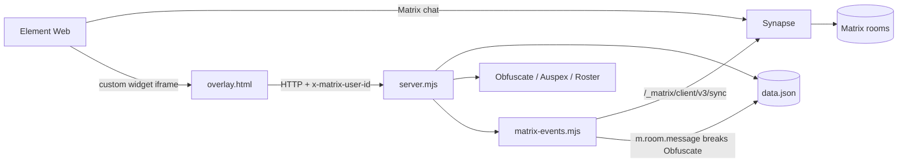

# Phase 1 Real Integration

Current implementation summary for the delivered Phase 1 Matrix/Element proof of concept.

## Components

- `server.mjs`: HTTP sidecar, overlay host, RPG API, Matrix watcher startup, `/matrix/status`.
- `store.mjs`: local JSON runtime state in `phase1/data.json`.
- `obfuscate.mjs`, `auspex.mjs`, `roster.mjs`: RPG power and visibility logic ported from the existing legacy behavior.
- `matrix-client.mjs`: dependency-free Matrix Client-Server helper.
- `matrix-events.mjs`: Matrix `/sync` polling and `m.room.message` handling.
- `setup-matrix.mjs`: local Synapse user and room provisioning.
- `overlay.html`: Element-widget-compatible RPG roster panel.
- `matrix/`: Synapse and Element Web Docker setup.

## Architecture



## Validated Flow

1. Start Synapse and Element.
2. Provision `@a:local`, `@b:local`, `@c:local`, and `@staff:local`.
3. Provision the seeded Matrix rooms and write real Matrix IDs to `data.json`.
4. Start the sidecar with `MATRIX_BASE_URL=http://localhost:8008`.
5. A uses Obfuscate in the overlay.
6. A disappears from B and C in the RPG overlay roster, while A remains in the Matrix room.
7. B uses Auspex and sees A as revealed.
8. C still cannot see A.
9. A sends a public Matrix message in Element or through the Matrix API.
10. The Matrix sync watcher receives the real `m.room.message` event and breaks Obfuscate.
11. Everyone sees A again in the overlay roster.
12. Staff log records Obfuscate, Auspex, and message-break events.

## Validation

Run:

```powershell
node .\phase1\server.mjs --self-test
node .\phase1\matrix-client.mjs
node .\phase1\matrix-events.mjs
node .\phase1\setup-matrix.mjs --self-test
node .\phase1\test.mjs
node .\phase1\test-matrix-flow.mjs
```

The formal validation report is `phase1/VALIDATION-REPORT.md`.

## Scope Boundary

Phase 1 implements RPG roster invisibility. It does not hide Matrix-native membership lists, and it does not modify Matrix room membership when a character uses Obfuscate.

## Production Work

Production hardening remains around token validation, persistence, monitoring, recovery, deployment, security, and performance. No Phase 1 functional behavior remains intentionally unimplemented.
